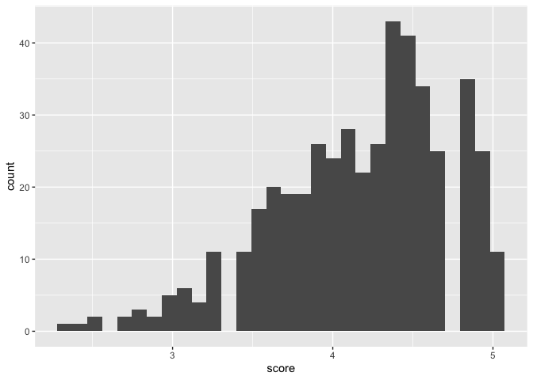
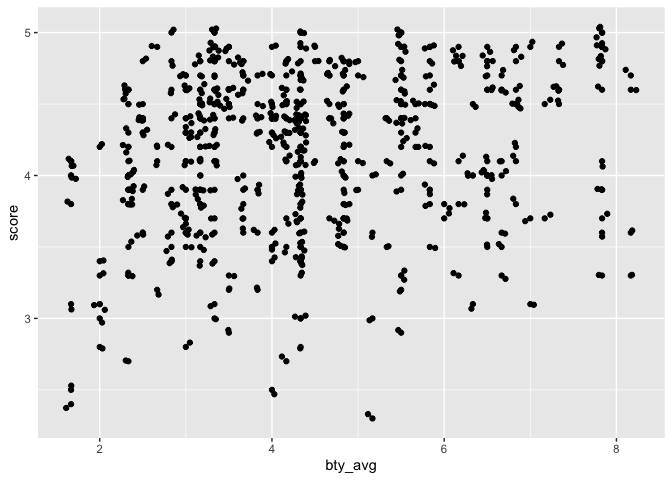
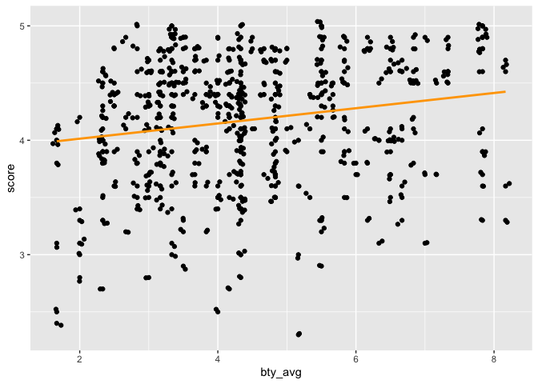

Lab 09 - Grading the professor, Pt. 1
================
Marq Schieber
4/21/22

### Load packages and data

``` r
library(tidyverse) 
library(tidymodels)
library(openintro)
library(broom)
```

### Exercise 1 Visualize the distribution of score. Is the distribution skewed? What does that tell you about how students rate courses? Is this what you expected to see? Why, or why not? Include any summary statistics and visualizations you use in your response.

``` r
ggplot(evals,aes(x = score)) +
  geom_histogram()
```

    ## `stat_bin()` using `bins = 30`. Pick better value with `binwidth`.

<!-- -->

Scores are negatively skewed. Students generally rate their professors
favorably.Honeslty I expected a normal distribution, but it makes sense
that people typically have a high opinion of their professors.

### Exercise 2 Visualize and describe the relationship between score and the variable bty_avg, a professor’s average beauty rating.

``` r
ggplot(evals,aes(x = bty_avg , y = score)) +
  geom_point()
```

<!-- -->

I cannot discern a relationship from the point plot. The line graph was
even worse.

### Exercise 3 Replot the scatterplot from Exercise 2, but this time use geom_jitter()? What does “jitter” mean? What was misleading about the initial scatterplot?

``` r
ggplot(evals, aes(x = bty_avg , y = score)) +
  geom_point()+
  geom_jitter()
```

<!-- -->

Jitter adds a small amount of variation to each point in order to
correct for overplotting. The initial scatterplot was misleading,
because it did not illustrate the full extant of the plotted points. The
new plot appears to show a linear trend, where scores increase with
greater attractiveness.

### Exercise 4 Let’s see if the apparent trend in the plot is something more than natural variation. Fit a linear model called m_bty to predict average professor evaluation score by average beauty rating (bty_avg). Based on the regression output, write the linear model.

score = 3.88 + BeautyAvg\*.067

``` r
m_bty = lm(score ~ bty_avg, data=evals) 

summary(m_bty)
```

    ## 
    ## Call:
    ## lm(formula = score ~ bty_avg, data = evals)
    ## 
    ## Residuals:
    ##     Min      1Q  Median      3Q     Max 
    ## -1.9246 -0.3690  0.1420  0.3977  0.9309 
    ## 
    ## Coefficients:
    ##             Estimate Std. Error t value Pr(>|t|)    
    ## (Intercept)  3.88034    0.07614   50.96  < 2e-16 ***
    ## bty_avg      0.06664    0.01629    4.09 5.08e-05 ***
    ## ---
    ## Signif. codes:  0 '***' 0.001 '**' 0.01 '*' 0.05 '.' 0.1 ' ' 1
    ## 
    ## Residual standard error: 0.5348 on 461 degrees of freedom
    ## Multiple R-squared:  0.03502,    Adjusted R-squared:  0.03293 
    ## F-statistic: 16.73 on 1 and 461 DF,  p-value: 5.083e-05

### Exercise 5 Replot your visualization from Exercise 3, and add the regression line to this plot in orange color. Turn off the shading for the uncertainty of the line.

``` r
ggplot(evals, mapping = aes(x=bty_avg, y=score)) + 
  geom_point() + 
  geom_jitter() + 
  geom_smooth(method = lm, color = "orange", se = FALSE)
```

    ## `geom_smooth()` using formula 'y ~ x'

<!-- -->

### Exercise 6 Interpret the slope of the linear model in context of the data.

For every point increase a professor gets in attractiveness, their
evaluation scores increase by .0664.

### Exercise 7 Interpret the intercept of the linear model in context of the data. Comment on whether or not the intercept makes sense in this context.

A professor with a attractiveness score of 0 would get a 3.88 evaluation
score. This makes sense, considering the positive skew of the data set.
Professors are generally rated at least or above average.

### Exercise 8 Determine the r-square of the model and interpret it in context of the data.

``` r
summary(m_bty)$r.squared
```

    ## [1] 0.03502226

R-squared is .035. This states that 3.5% of the variance in scores in
explained by professor attractiveness.

### Exercise 9 Fit a new linear model called m_gen to predict average professor evaluation score based on gender of the professor. Based on the regression output, write the linear model and interpret the slope and intercept in context of the data.

score = 4.09 + Gender\*.141 (males)

It appears that males professors receive higher ratings than female
professors.

``` r
m_gen <- lm(score ~ gender, data=evals) 

summary(m_gen)
```

    ## 
    ## Call:
    ## lm(formula = score ~ gender, data = evals)
    ## 
    ## Residuals:
    ##      Min       1Q   Median       3Q      Max 
    ## -1.83433 -0.36357  0.06567  0.40718  0.90718 
    ## 
    ## Coefficients:
    ##             Estimate Std. Error t value Pr(>|t|)    
    ## (Intercept)  4.09282    0.03867 105.852  < 2e-16 ***
    ## gendermale   0.14151    0.05082   2.784  0.00558 ** 
    ## ---
    ## Signif. codes:  0 '***' 0.001 '**' 0.01 '*' 0.05 '.' 0.1 ' ' 1
    ## 
    ## Residual standard error: 0.5399 on 461 degrees of freedom
    ## Multiple R-squared:  0.01654,    Adjusted R-squared:  0.01441 
    ## F-statistic: 7.753 on 1 and 461 DF,  p-value: 0.005583

### Exercise 10 What is the equation of the line corresponding to male professors? What is it for female professors?

score = 4.09 + 1*.141 (males) score = 4.09 + 0*.141 (females)

### Exercise 11 Fit a new linear model called m_rank to predict average professor evaluation score based on rank of the professor. Based on the regression output, write the linear model and interpret the slopes and intercept in context of the data.

score = 4.28 - ranktenuretrack*.130 - ranktenured*.145

At rank level 0 (teaching) scores are 4.28 At tenure track scores
decrease by .130 At tenured scores decrease by .145

``` r
m_rank <- lm(score ~ rank, data=evals) 

summary(m_rank)
```

    ## 
    ## Call:
    ## lm(formula = score ~ rank, data = evals)
    ## 
    ## Residuals:
    ##     Min      1Q  Median      3Q     Max 
    ## -1.8546 -0.3391  0.1157  0.4305  0.8609 
    ## 
    ## Coefficients:
    ##                  Estimate Std. Error t value Pr(>|t|)    
    ## (Intercept)       4.28431    0.05365  79.853   <2e-16 ***
    ## ranktenure track -0.12968    0.07482  -1.733   0.0837 .  
    ## ranktenured      -0.14518    0.06355  -2.284   0.0228 *  
    ## ---
    ## Signif. codes:  0 '***' 0.001 '**' 0.01 '*' 0.05 '.' 0.1 ' ' 1
    ## 
    ## Residual standard error: 0.5419 on 460 degrees of freedom
    ## Multiple R-squared:  0.01163,    Adjusted R-squared:  0.007332 
    ## F-statistic: 2.706 on 2 and 460 DF,  p-value: 0.06786

### Exercise 12 Create a new variable called rank_relevel where “tenure track” is the baseline level.

``` r
evals_v2 <- evals %>%
  mutate(rank_relevel = relevel(rank, ref = "tenure track"))
```

### Exercise 13 Fit a new linear model called m_rank_relevel to predict average professor evaluation score based on rank_relevel of the professor. This is the new (releveled) variable you created in Exercise 13. Based on the regression output, write the linear model and interpret the slopes and intercept in context of the data. Also determine and interpret the r-square of the model.

score = 4.15 + teaching*.130 - ranktenured*.015

At rank level 0 (tenured track) scores are 4.215 At teaching level
scores increase by .130 At tenured scores decrease by .015

The r-square is .011. That means that 1.1% of the variance in scores can
be explained by the model.

``` r
m_rank_relevel <- lm(score ~ rank_relevel, data=evals_v2)
summary(m_rank_relevel)
```

    ## 
    ## Call:
    ## lm(formula = score ~ rank_relevel, data = evals_v2)
    ## 
    ## Residuals:
    ##     Min      1Q  Median      3Q     Max 
    ## -1.8546 -0.3391  0.1157  0.4305  0.8609 
    ## 
    ## Coefficients:
    ##                      Estimate Std. Error t value Pr(>|t|)    
    ## (Intercept)           4.15463    0.05214  79.680   <2e-16 ***
    ## rank_relevelteaching  0.12968    0.07482   1.733   0.0837 .  
    ## rank_releveltenured  -0.01550    0.06228  -0.249   0.8036    
    ## ---
    ## Signif. codes:  0 '***' 0.001 '**' 0.01 '*' 0.05 '.' 0.1 ' ' 1
    ## 
    ## Residual standard error: 0.5419 on 460 degrees of freedom
    ## Multiple R-squared:  0.01163,    Adjusted R-squared:  0.007332 
    ## F-statistic: 2.706 on 2 and 460 DF,  p-value: 0.06786

### Exercise 14 Create another new variable called tenure_eligible that labels “teaching” faculty as “no” and labels “tenure track” and “tenured” faculty as “yes”.

``` r
evals_v2 <- evals_v2 %>%
  mutate(tenure_eligible = recode(rank, "tenure track" = "yes", "tenured" = "yes", "teaching" = "no"))
```

### Exercise 15 Fit a new linear model called m_tenure_eligible to predict average professor evaluation score based on tenure_eligibleness of the professor. This is the new (regrouped) variable you created in Exercise 15. Based on the regression output, write the linear model and interpret the slopes and intercept in context of the data. Also determine and interpret the r-square of the model.

scores = 4.28 - tenure_eligible\*.141

not tenured eligible get a score of 4.28 tenure eligible professors
decrease scores by .141

r-square is .0115. 1.15% of the variance in scores can be explained by
whether the professor is tenure eligible or not.

``` r
m_tenure_eligible <- lm(score ~ tenure_eligible, data=evals_v2)


summary(m_tenure_eligible)
```

    ## 
    ## Call:
    ## lm(formula = score ~ tenure_eligible, data = evals_v2)
    ## 
    ## Residuals:
    ##     Min      1Q  Median      3Q     Max 
    ## -1.8438 -0.3438  0.1157  0.4360  0.8562 
    ## 
    ## Coefficients:
    ##                    Estimate Std. Error t value Pr(>|t|)    
    ## (Intercept)          4.2843     0.0536  79.934   <2e-16 ***
    ## tenure_eligibleyes  -0.1406     0.0607  -2.315    0.021 *  
    ## ---
    ## Signif. codes:  0 '***' 0.001 '**' 0.01 '*' 0.05 '.' 0.1 ' ' 1
    ## 
    ## Residual standard error: 0.5413 on 461 degrees of freedom
    ## Multiple R-squared:  0.0115, Adjusted R-squared:  0.009352 
    ## F-statistic: 5.361 on 1 and 461 DF,  p-value: 0.02103
